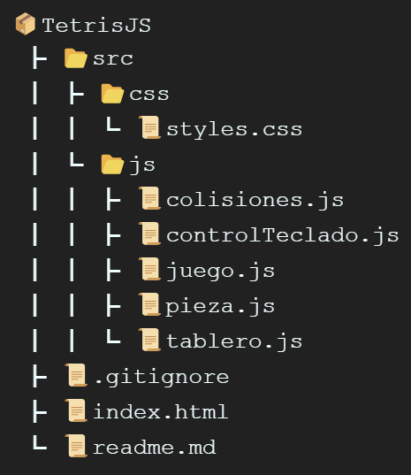

# TetrisJS por Rubén Arjona

Este proyecto implementa el clásico juego Tetris utilizando únicamente HTML, CSS y JavaScript.

## ¡JUGAR!

- Puedes probar el juego en este link: [TetrisJS](https://tetrisbyjooseeruu.netlify.app/)

## Instalación

1. Clonar el repositorio:

    ```bash
    git clone https://github.com/jooseeruu/TetrisJS.git
    ```

2. Abre el archivo `index.html` en tu navegador.

## Controles

- **A** -> Mover a la izquierda.
- **D** -> Mover a la derecha.
- **S** -> Acelerar descenso.
- **W** -> Rotar pieza.

## Estructura del Proyecto (Codigo Modular)



## Funciones

`dibujarTablero()`: Esta función se encarga de dibujar el tablero del juego en el canvas. Recorre todas las filas y columnas del tablero, y para cada celda, selecciona un color basado en su valor (gris si la celda está ocupada y negro si está vacía). Luego, dibuja la celda y su borde en el canvas para mayor claridad durante el juego.

`generarPieza()`: Esta función se encarga de generar una nueva pieza de juego de manera aleatoria. Primero, genera un número aleatorio entre 0 y 1. Luego, recorre todas las piezas disponibles y acumula sus probabilidades. Si el número aleatorio es menor que la probabilidad acumulada, retorna la pieza correspondiente.

`chequearColisiones(pieza, x, y)`: Esta función verifica si una pieza en una posición dada colisiona con los bordes del tablero o con otras piezas ya colocadas. Retorna `true` si hay una colisión y `false` en caso contrario.

`posicionaPieza(pieza, x, y)`: Esta función coloca una pieza en el tablero en la posición especificada, actualizando el tablero con la forma de la pieza.

`dibujarPieza(pieza, x, y)`: Esta función dibuja una pieza en el canvas en la posición especificada.

`rotarPieza(pieza)`: Esta función rota una pieza 90 grados en sentido horario y retorna la nueva forma de la pieza.

`actualizar()`: Esta función actualiza el estado del juego, moviendo la pieza actual hacia abajo y verificando colisiones. Si la pieza colisiona, se posiciona en el tablero, se generan nuevas piezas y se verifica el fin del juego.

`jugar()`: Esta función es llamada periódicamente para actualizar el estado del juego y redibujar el tablero y la pieza actual.

`eliminarLinea()`: Esta función verifica y elimina las líneas completas del tablero, actualizando la puntuación del jugador.

`actualizarPuntuacionYNivel(lineasEliminadas)`: Esta función actualiza la puntuación del jugador según el número de líneas eliminadas.

`incrementarDificultad()`: Esta función incrementa la dificultad del juego al aumentar el nivel y disminuir el intervalo de tiempo entre actualizaciones, basado en la puntuación del jugador.